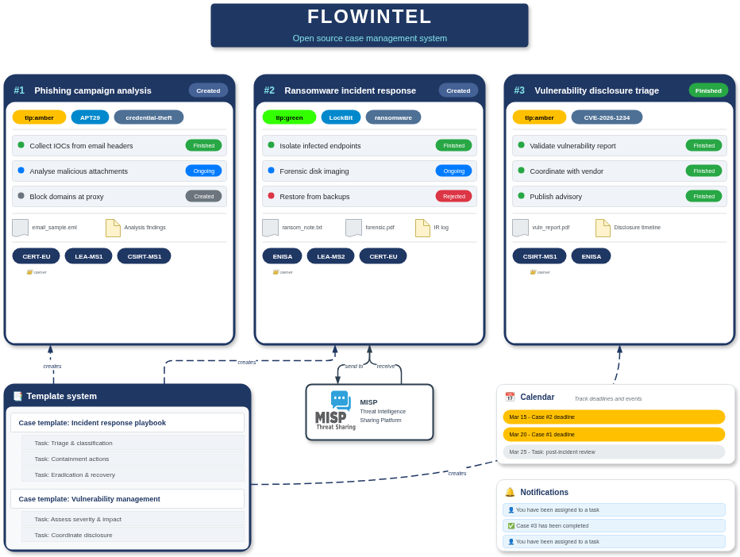
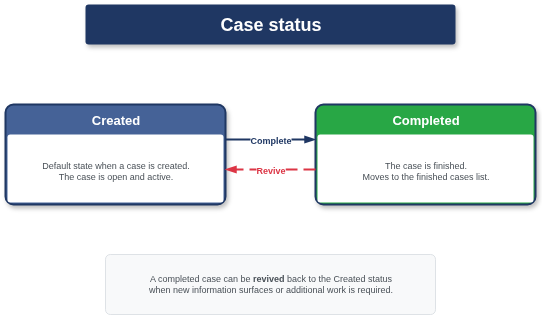
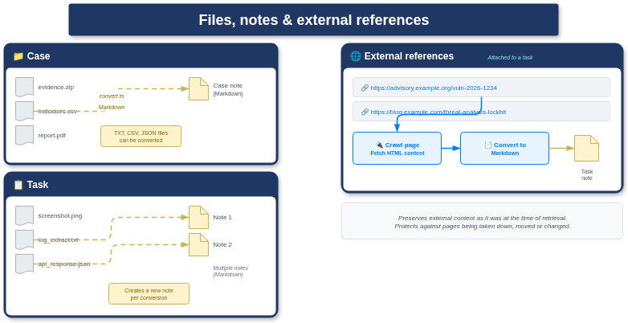
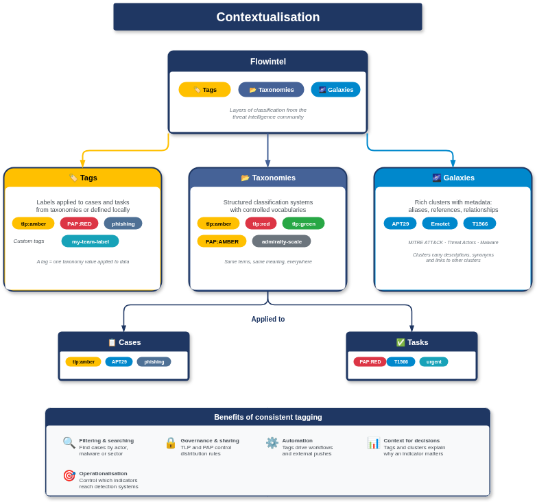
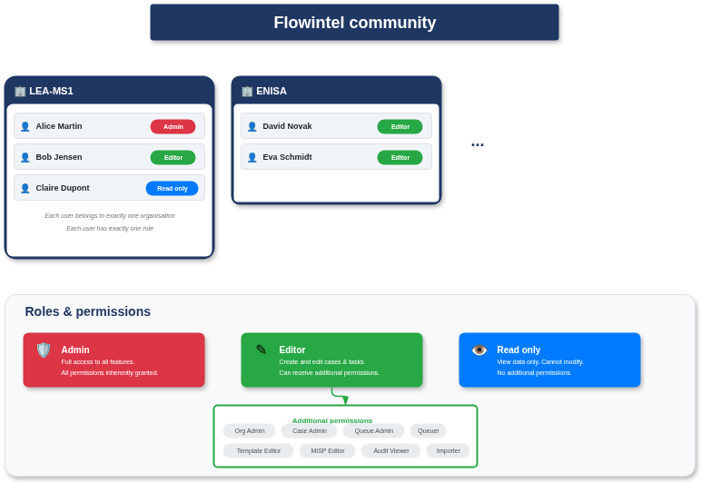
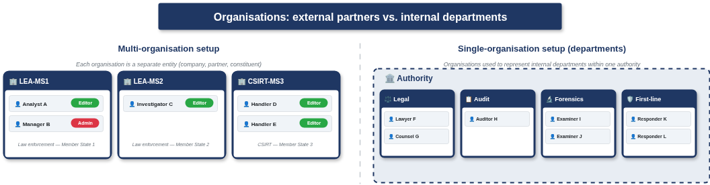

# Flowintel user manual

## What is Flowintel

Flowintel is an open-source case management platform for security analysts and threat intelligence experts. It is developed by [CIRCL](https://www.circl.lu/) and co-funded under the FETTA (Federated European Team for Threat Analysis) project.

Everything in Flowintel centres around **cases** and **tasks**. A case describes a situation that needs to be investigated or handled. Within a case, you create one or more tasks that represent the individual steps of work. Cases and tasks can be enriched with tags, taxonomies and galaxy clusters, which brings the same classification standards used in threat intelligence sharing directly into your case management workflow.

Flowintel also integrates with [MISP](https://www.misp-project.org/) for **sharing findings**. Once a case is complete, you can push it to a MISP instance together with all indicators, notes and objects. From there, MISP's synchronisation features allow you to distribute the case to other teams and communities.

Beyond cases and tasks, Flowintel includes a templating system for repeatable workflows, a calendar view for tracking deadlines, a notification system, analysis modules powered by MISP modules, data export to platforms such as MISP and AIL, and full audit logging.



## Follow up on your work

Once you are logged in, Flowintel gives you several ways to keep track of what is happening and what needs your attention. This section covers the home page, notifications and your personal task list.

### The home page

After logging in, you land on the Flowintel home page. At the top, a welcome banner greets you by name and shows three summary badges:

- The number of **open cases** you have access to, linking directly to the case list.
- The number of **tasks assigned** to you. If you have tasks waiting, the badge links to your personal task list. If you have none, the badge confirms that no tasks are assigned.
- The number of **unread notifications**. If there are any, the badge links to the notification page.

Below the welcome banner, the home page displays a list of the most recently modified cases. For each case, you can see the case ID and title, a relative timestamp showing when it was last changed, the description, the current status, how many tasks are open and closed, the deadline, and any tags, taxonomies or galaxy clusters attached to the case. Private cases only appear here if you belong to an organisation assigned to the case or if you are an administrator.

This list gives you a quick overview of where activity is happening across the cases you have access to, without needing to navigate to the full case list.

### Notifications

Flowintel keeps you informed through **in-app notifications**. To view your notifications, click the bell icon. The notification page shows a list of notifications with an icon indicating the type, the message text, and a timestamp showing when it was received or when it was read.

Notifications are created automatically when something relevant happens. The main situations that trigger a notification are:

- You are **assigned to a task**, or removed from a task.
- A case is **completed**, revived or deleted.
- A task assigned to you is completed or revived.
- Your organisation is added to a case, removed from a case, or made the owner of a case.
- A deadline on a case or task you are involved in is approaching (within ten days).
- In a privileged case, a task is submitted for approval or a task you requested is approved or rejected.
- A user requests a **password reset** (sent to administrators).

#### Filtering notifications

At the top of the notification page, you can switch between unread and read notifications. A time filter lets you narrow the list to notifications from today, this week, or all time. You can also filter by type or category. When a filter is active, a count shows how many notifications match out of the total.

#### Acting on notifications

Each notification can be marked as read or unread by clicking the checkbox next to it. You can also mark all unread notifications as read at once using the button at the top of the list. To remove a notification permanently, click the delete button on that row. Clicking on a notification itself navigates you to the related case.

### Tasks assigned to you

The **Tasks assigned** section in the sidebar takes you to a personal overview of all tasks you are currently assigned to. This page only shows tasks where you are listed as an assigned user.

At the top, a statistics banner summarises your workload: the total number of tasks assigned to you, how many are overdue, and how many are due this week.

Tasks are grouped by the case they belong to. For each task, you can see the title, a relative timestamp of when it was last changed, the description, the current status, tags, the other users assigned, the deadline, and any incomplete subtasks. Deadlines are colour-coded to help you spot urgent items: overdue tasks are highlighted in red, tasks due today or tomorrow in yellow, and tasks further out or without a deadline in grey.

You can switch between ongoing and finished tasks, and sort the list by title, last modification, deadline or status. The sort order can be reversed.


## Cases

Everything in Flowintel starts with a case. A case represents a situation that your team needs to investigate, respond to or track. There is no limit on how many cases Flowintel can store - it depends only on the available system resources.

A case is owned by the organisation of the user who creates it. Other organisations can be assigned to the case later, allowing cross-team collaboration. If you use Flowintel organisations to represent internal departments, this means each case naturally tracks which department initiated the investigation. Within a case, you create tasks to break the work down into individual steps.

Each case is automatically assigned a unique **ID** (the number displayed in front of the case title) and a unique UUID. The ID is a simple sequential number used within Flowintel. The UUID is a universally unique identifier that can be used for integration with external systems.

### Creating a case

Navigate to **Cases** in the sidebar and click the plus button to create a new case.

The following fields are available:

- **Title** (required): a short name for the case. Must be unique across all cases in Flowintel.
- **Description** (optional): a free-text field that supports Markdown. Use it to describe the situation, provide background or record initial findings.
- **Deadline date** (optional): the date by which the case should be completed.
- **Deadline time** (optional): a specific time for the deadline. Only applies when a deadline date has been set.
- **Time required** (optional): an estimate of how much effort the case will take, as free text (for example, "2 hours" or "3 days").
- **Ticket ID** (optional): a reference to an external ticketing system. Useful when Flowintel is used alongside another platform.

### Editing a case

From the case detail page, click the edit button. You can change the title, description, deadline, time required, ticket ID, and the private and privileged toggles. 

Tags, taxonomies and galaxies are edited separately from the same page.

Only users who belong to an organisation assigned to the case can edit it. Administrators can always edit any case. In a privileged case, only an administrator or Case Admin can change the privileged toggle.

### Deleting a case

From the case detail page, use the Actions menu on the top right and choose Delete. Flowintel asks for confirmation before proceeding. Deleting a case removes the case itself, all its tasks, all attached files and the case history. This action cannot be undone.

Only users with sufficient permissions who belong to an organisation assigned to the case can delete it. In a privileged case, only an administrator or Case Admin can delete the case.

### Behaviour settings

When creating or editing a case, two choices control how the case behaves:

- **Private case**: when enabled, only users whose organisation is assigned to the case can see it. Other users, except administrators, will not find the case in any listing. Use this for sensitive investigations that should not be visible to the entire platform.
- **Privileged case**: when enabled, certain actions on the case require authorisation from a user with elevated permissions. In a privileged case, a user with the Queuer permission cannot directly create tasks in the normal way. Instead, their tasks are created with a Requested status and must be approved by an administrator, Case Admin or Queue Admin before they become active. This implements a four-eye principle where an analyst's work is verified by a supervisor.

In short, a private case controls who can see it, while a privileged case controls who can manage it.

Your Flowintel instance may be configured to enforce privileged mode on every new case automatically. In that situation, the checkbox is ticked for you and cannot be changed.

### Contextual elements

Cases support several types of metadata that help with classification and searching. You can add these when creating a case or edit them afterwards.

- **Taxonomy tags**: tags from MISP taxonomies such as the Traffic Light Protocol (TLP) or the ENISA incident classification. These follow the same standards used in threat intelligence sharing and allow you to label cases consistently.
- **Galaxy clusters**: entries from MISP galaxies, for example a specific threat actor from the Threat Actor galaxy or a technique from the MITRE ATT&CK framework. Attaching galaxy clusters to a case links it to known threats and attack patterns.
- **Custom tags**: tags that are defined locally in your Flowintel instance, independent of any MISP taxonomy. Use these for labels that are specific to your team or organisation.

### Case status

A case has two statuses:

| Status | Meaning |
|---|---|
| **Created** | The case is open and active. This is the initial state when a case is created. |
| **Completed** | The case is finished. It moves out of the active case list and into the finished cases. |

To mark a case as complete, open the case and click the complete button at the top right. Flowintel sets the case to **Completed** and records the finish date. A notification is sent to all organisations involved in the case.

To revive a completed case, navigate to finished cases, open the case and click the revive button. This brings the case back to the **Created** status and makes it appear in the active case list again. The tasks are not automatically revived; only the case itself returns to the open state. You can then reopen individual tasks as needed.

Flowintel does not require all tasks to be closed or finished before you complete a case. You are free to close a case at any point, regardless of the state of its tasks. When you later revive the case, each task keeps the status it had at the time the case was closed.

Reviving is useful when new information surfaces or when additional work is required on a case that was thought to be finished.

In a privileged case, only an administrator or Case Admin can complete or revive the case.



### Note

A case can have one note written in Markdown. Use it to document findings, analysis or anything relevant to the case as a whole. The note is visible on the case detail page and can be edited at any time.

### Files on a case

You can attach files to a case, for example evidence, logs, exported data or reports. To upload files, go to the case detail page and use the file upload area. You can upload multiple files at once. Each file is stored with its original name and can be downloaded at any time.

To delete a file, click the delete button next to it. The file is removed permanently.

#### Converting a file to a note

If an attached file is a TXT, CSV or JSON file, you can convert it to a note. This reads the content of the file and appends it to the case note. The original file is kept after conversion.

This is particularly useful in day-to-day case management. During an investigation, you often receive data as files: a CSV export from a log management system, a JSON response from an API, or a plain text summary from a colleague. Rather than asking everyone to open and read the file separately, you can convert it to a note, which makes the content directly visible on the case page. This keeps the information accessible without requiring a download and means the key data is part of the case narrative rather than buried in an attachment.

### The case list

Navigating to **Cases** in the sidebar shows you the list of cases you have access to. For each case, the list displays:

- the case ID and title
- whether the case is private or privileged
- the status of the case
- how many tasks are open and how many are completed
- the owner organisation and any other associated organisations
- the deadline
- when the case was last changed
- the tags, taxonomies and galaxies attached to the case

At the top of the list, you have shortcuts to quickly sort by date, title or ID. You can also filter cases by title, tags, taxonomies or galaxies, and further sort by:

- Last modification
- Creation date
- Title
- Deadline
- Status
- My Org

You can reverse the sort order at any time.

By default, the case list shows open cases. A button at the top allows you to switch to finished cases. From the finished cases view, you can switch back to the open cases in the same way.

### Case detail view

Clicking on a case in the list opens its detail page. At the top, you can see when the case was created, when it was last modified, and a summary of tasks showing how many are open and how many are closed.

The detail page also shows the number of files, objects and connectors associated with the case.

### Assigning organisations

By default, the case is assigned to the organisation of the user who created it. You can assign additional organisations to the case, which gives their users access to the case and its tasks. This is how you set up collaboration between teams.

A case must always have exactly one owner organisation. You can switch which organisation is the owner, but you cannot remove the owner without assigning a different one first.

### Linked cases

You can link a case to one or more other cases in Flowintel. This is useful when an investigation is an extension of a previous case or when two cases are related. Linked cases appear on the case detail page, allowing you to navigate between them.

### Case history and info

From the case detail page, you can access the case history, which is a full audit log of all actions performed on the case. This shows who did what and when, providing a complete trail for accountability and review.

You can also view the case info, which includes the case's UUID and other metadata.

### MISP objects

MISP objects let you attach structured threat intelligence data directly to a case. Tags and galaxies provide classification labels, but MISP objects go further: they store actual indicators and observables such as file hashes, IP addresses, domain names and email addresses, all in a standardised format.

A MISP object is based on an **object template**. Flowintel ships with the full library of MISP object templates, which define what attributes an object of a given type can hold. The **file** template, for instance, has attributes for filename, MD5, SHA-1, SHA-256, file size and more. The **ip-port** template covers IP address, port, protocol and domain. The **email** template includes sender, recipient, subject line and header fields.

You do not need to fill in every attribute that a template defines. Fill in the attributes that are relevant to your investigation and that are required by the object template.

#### Creating a MISP object

To add a MISP object to a case, open the case detail page and navigate to the **MISP objects** tab. Click the button to create a new object. Flowintel presents a list of commonly used object templates at the top, covering categories such as domain/IP, URL/domain, file/hash, vulnerability, financial and personal. You can also pick any other template from the full list. The list shows each template with its name and description, and you can search by name.

Once you have selected a template, click on the **attribute** tab to start entering attributes. The template displays which attributes are required at minimum, for instance: *"requires one of: url, resource_path"*. For each attribute, you can provide:

- **Value** (required): the actual data, such as `192.168.1.100` or `malware.exe`.
- **Type**: the MISP attribute type (`ip-dst`, `md5`, `filename`, `email-src` and so on). Usually pre-filled based on the template.
- **First seen** (optional): when the indicator was first observed.
- **Last seen** (optional): when the indicator was last observed.
- **Comment** (optional): a free-text annotation.
- **IDS flag**: whether this attribute should be used for intrusion detection.
- **Disable correlation**: whether to exclude this attribute from automatic correlation.

Click **add attribute** to add the attribute to the object. When you are done adding attributes, click **save changes** to add the object to the case.

#### Editing and deleting attributes

Each attribute within an object can be edited or deleted individually. Open the object, find the attribute and use the edit or delete button. Deleting an attribute removes it permanently.

#### Deleting an object

To delete an entire MISP object, open the object and click the delete button. This removes the object and all its attributes from the case. The deletion cannot be undone.

#### Analysing objects

*to complete*

### Case connectors

Connectors link a case to external platforms such as MISP or AIL. Before you can use connectors on a case, they need to be configured at the platform level under **Tools > Connectors** (see the Connectors and instances section below).

To manage connectors on a case, open the case detail page and navigate to the connectors tab.

#### Adding a connector to a case

Click the button to add a connector and select one of the configured connector instances from the list. 

You can attach multiple connector instances to the same case. For example, you might have one MISP instance for internal sharing and another for community sharing, or one connector to send to MISP and another one to receive from MISP.

#### Pushing data to MISP

Once a MISP connector is attached, you can push the case data to the MISP instance if it's of the **send_to** type. Flowintel creates or updates a MISP event with the case title and description, and includes all MISP objects and their attributes. Tags attached to the case are also synchronised.

The first push creates a new MISP event and stores the event UUID as the connector identifier. Subsequent pushes update the existing event.

#### Receiving data from MISP

If the connector instance is configured as a **receive_from** type, you can pull data from MISP into Flowintel. This fetches the MISP event by its identifier and creates or updates local MISP objects and attributes to match.

#### Editing and removing connectors

You can edit the identifier of a case connector or remove it entirely. Removing a connector from a case does not delete any data on the external platform. It only breaks the link between the case and the external instance.


## Tasks

Tasks are the building blocks of a case. Each task represents a single piece of work that needs to be carried out as part of the investigation or response. A case can contain any number of tasks.

### Creating a task

Open a case and click the button to create a new task.

The following fields are available:

- **Title** (required): a short name for the task.
- **Description** (optional): a free-text field in Markdown. Use it to describe what needs to be done, include instructions or reference external resources.
- **Time required** (optional): an estimate of the effort needed, as free text.
- **Deadline date** (optional): the date by which the task should be finished.
- **Deadline time** (optional): a specific time for the deadline. Only applies when a deadline date has been set.

You can also add taxonomy tags, galaxy clusters and custom tags when creating a task.

### Editing a task

From the task detail view, click the edit button. You can change the title, description, time required, deadline, and the tags, taxonomies and galaxies attached to the task.

Only users who belong to an organisation assigned to the case can edit tasks. In a privileged case, tasks with a Requested or Rejected status can only be edited by an administrator, Case Admin or Queue Admin.

### Deleting a task

From the task detail view, click the delete button. Flowintel asks for confirmation. Deleting a task removes it together with its notes, files, subtasks, URLs and external references. This action cannot be undone.

The same access rules apply as for editing: you must belong to an organisation in the case, and restricted tasks in privileged cases require elevated permissions.

### Contextual elements on tasks

Tasks support the same contextual metadata as cases:

- **Taxonomy tags**: MISP taxonomy tags such as TLP or incident classification.
- **Galaxy clusters**: entries from MISP galaxies such as MITRE ATT&CK techniques or threat actors.
- **Custom tags**: locally defined tags specific to your Flowintel instance.

Adding contextual elements to individual tasks allows you to classify work at a more granular level than the case itself.

### Task status

Each task goes through a set of statuses that track its progress:

| Status | Meaning |
|---|---|
| **Created** | The task has been created but work has not started. |
| **Ongoing** | Work on the task is in progress. |
| **Recurring** | The task repeats and is not expected to be completed once. |
| **Unavailable** | The task cannot be worked on at this time. |
| **Rejected** | The task has been rejected and will not be carried out. |
| **Finished** | The task has been completed. |

In a privileged case, two additional statuses apply to tasks created by users with the Queuer permission:

| Status | Meaning |
|---|---|
| **Requested** | The task has been submitted by a Queuer and is waiting for approval. |
| **Approved** | The task has been approved by an administrator, Case Admin or Queue Admin. |

To change the status of a task, open the task and select a new status from the dropdown. The assigned users are notified when the status changes. In a privileged case, moving a task from Requested to Approved or Rejected triggers a notification to all approvers and assigned users.

To mark a task as finished, you can either set its status to Finished or click the complete button. Completing a task records the finish date and moves the task to the bottom of the task list. To revive a completed task, click the same button again. This sets the task back to the Created status and places it at the end of the open task list.

### Assigning users

A task can be assigned to one or more users. Assigning a user makes it visible in their personal task list, which is accessible from the **Tasks assigned** section in the sidebar.

You can assign yourself to a task by clicking the take button, or assign other users from the assignment panel. To remove an assignment, use the remove button next to the user's name. When a user is assigned by someone else, they receive a notification. Likewise, a user is notified when they are removed from a task.

### Subtasks

Each task can have a set of subtasks. Subtasks are simple checklist items that help you break a task down further. You can add a subtask by entering a short description. Subtasks can be ticked off as they are completed, edited if the description needs changing, reordered to reflect priority, or deleted when they are no longer relevant.

### URLs and tools

You can attach URLs or tool references to a task. This is a free-text list where each entry holds a name or address - for example, a link to an internal wiki page, the name of a forensic tool to use, or a URL to an online service. Entries can be added, edited and deleted from the task detail page.

### Notes

You can add multiple notes to a task in Markdown. Notes are useful for recording findings, decisions or progress updates as work goes on. Each note is stored separately and can be edited or deleted individually.

### Files on a task

You can attach files to a task, for example evidence, screenshots, log extracts or reports. To upload, use the file upload area on the task detail page. You can upload multiple files at once. Files can be downloaded or deleted at any time.

#### Converting a file to a note

As with cases, TXT, CSV and JSON files attached to a task can be converted to a note. On a task, this creates a new note rather than appending to a single note. The original file is kept. See the explanation under Files on a case for why this is useful in practice.

### External references

External references allow you to preserve the content of an external source directly within a task. Where a URL or tool entry is simply a link or a name, an external reference goes further: you provide a URL, and Flowintel can fetch the content of that page and store it as a note on the task.

This is useful for sources that may not remain available indefinitely. If you are referencing a public advisory, a research paper, a blog post or a government notice, there is always a risk that the original page is taken down, moved or changed. By converting the external reference to a note, you preserve the content as it was at the time of retrieval, directly inside your case. The note includes a header showing the source URL and the date it was fetched.

To add an external reference, open the task and enter the URL. You can edit or delete it afterwards. To convert it to a note, click the convert button. Flowintel fetches the page, converts the HTML to Markdown and creates a new note on the task with the content.




## Contextualisation

Flowintel uses taxonomies, tags and galaxies to bring structure and consistency to your case data. These concepts come from the threat intelligence community and are shared with platforms like [MISP](https://www.misp-project.org/), which means the classifications you apply in Flowintel are directly compatible with the wider intelligence sharing ecosystem.

### Taxonomies

A taxonomy is a structured classification system: a controlled vocabulary with predefined categories and values. The purpose is to remove ambiguity. When everyone uses the same terms in the same way, data becomes comparable and searchable.

The Traffic Light Protocol illustrates why this matters. Without a controlled taxonomy, different teams might label the same sensitivity level as `TLP:clear`, `tlp:clear`, `tlp="clear"`, `tlp=clear` or even `trafficlight=clear`. A human reader might recognise these as equivalent, but a machine cannot. Inconsistent labelling breaks searches, prevents reliable correlation and makes automated processing nearly impossible.

Flowintel ships with a large library of community-developed taxonomies from the MISP project (see [MISP taxonomies](https://www.misp-project.org/taxonomies.html)). These cover common use cases such as:

- **Information sharing rules**: TLP (Traffic Light Protocol), PAP (Permissible Actions Protocol)
- **Confidence levels**: how reliable the source or assessment is
- **Threat types**: malware classification, incident types
- **Sectors**: industries and critical infrastructure sectors

Administrators can enable or disable specific taxonomies for their Flowintel instance.

### Tags

A tag is the label you actually apply to a case or task. It is a single instance of a taxonomy value attached to a piece of data. Where a taxonomy defines what labels exist and what they mean, a tag applies that meaning to a specific case or task.

For example, the TLP taxonomy defines the value `tlp:amber`. When you attach `tlp:amber` to a case, you have created a tag. That tag tells everyone who sees the case that it should be handled under TLP:AMBER rules.

Flowintel also supports **custom tags**, which are labels defined locally in your instance, independent of any published taxonomy. Use custom tags for classifications specific to your team or organisation that do not exist in any standard taxonomy.

### Galaxies and clusters

Taxonomies and tags provide simple labels, but some concepts need richer representation. A threat actor is more than a name. It may have aliases, known targets, preferred techniques and relationships to other actors or malware families. Capturing all of that in a single tag would be impractical.

Galaxies address this need. A galaxy is a collection of related knowledge organised into clusters. Each cluster represents a specific item, such as a particular threat actor, a malware family, a country, a sector, or an attack technique from the MITRE ATT&CK framework. Clusters can hold detailed metadata: descriptions, synonyms, references and relationships to other clusters.

Galaxies also support relationships between clusters. A threat actor cluster can link to the malware it uses, the sectors it targets and the techniques it favours. These relationships let analysts trace connections across their data, for instance from an actor to the tools it deploys and the industries it targets.

In Flowintel, you can attach galaxy clusters to cases and tasks just as you attach tags. The cluster brings along all its metadata, making it immediately visible on the case or task page.

### Benefits of consistent tagging

In day-to-day work, taxonomies, tags and galaxies help answer questions quickly:

- **Filtering and searching**: find all cases tagged with a specific threat actor, malware family, sector or confidence level, rather than relying on free-text search.
- **Governance and sharing**: TLP tags control distribution rules. PAP tags indicate what recipients may do with the data. Workflow tags show whether intelligence has been reviewed.
- **Automation**: tags drive automated workflows. They describe which cases should be pushed to external platforms, how they should be processed and which detection controls receive them.
- **Operationalisation**: when combined with MISP objects and connectors, tags control which indicators reach detection systems. Indicators can be marked as suitable for blocking, for alerting only, or not yet validated.
- **Context for decisions**: tags and galaxy clusters supply the surrounding context: why it matters, how confident the source is and what action is expected.

### How taxonomies, tags and galaxies work together

The taxonomy defines what labels exist and what they mean. The tag applies that meaning to a specific case or task. Galaxies go further by grouping related concepts into structured clusters with richer metadata. Used together, they give your case data the structure and consistency needed for searching, comparison and automation.




## Connectors and instances

Connectors allow Flowintel to exchange data with external platforms such as MISP and AIL. They are managed under **Tools > Connectors** in the sidebar.

### Permissions

Only users with the **Admin** system role can create, edit or delete connectors and connector instances at the platform level. All authenticated users can view the list of configured connectors.

To use connectors within cases (attaching them, pushing or pulling data), you need at least an **Editor** role and must belong to an organisation assigned to the case.

*check MISP Editor role*

### Connector types

Each connector can have one or more **instances**.

### Instances

An instance is a connection to a specific server. Each instance requires:

- **Name** (required): a descriptive name, such as "Production MISP" or "Community MISP".
- **URL** (required): the base URL of the external service (e.g. `https://misp.example.org`).
- **Type** (required): the direction of data flow. For MISP, two types are available:
  - **send_to**: push data from Flowintel to the MISP instance. Use this to export cases, objects and attributes.
  - **receive_from**: pull data from the MISP instance into Flowintel. Use this to import or update cases from existing MISP events.
- **API key**: the authentication key for the external service. This can be configured in two ways:

*add about global instance*

### Setting up a MISP connector

To connect Flowintel with a MISP instance:

1. Navigate to **Tools > Connectors** and click on the MISP connector.
2. Click "Add an instance".
3. Provide the instance name, the MISP server URL, select the type (`send_to` or `receive_from`) and enter the API key.
4. Choose whether the API key is global (shared) or per-user.

You can create multiple instances under the same connector. A common setup is to have one **send_to** instance for pushing intelligence to your production MISP and one **receive_from** instance for pulling updates back.

*check global api key*

### Multiple instances

There is no limit on the number of instances you can configure. You might have separate instances for:

- An internal MISP server and a community MISP server.
- A production MISP and a staging MISP.
- A MISP instance for sending and another for receiving.
- Different external platforms entirely (MISP and AIL).

Each instance operates independently. When you attach connectors to a case, you select specific instances, so you have full control over where data flows.


## REST API

Flowintel includes a full REST API that lets you automate and integrate your case management workflows. Every action available through the web interface (creating cases, adding tasks, uploading files, managing users) can also be done through the API.

### Swagger documentation

The built-in Swagger documentation is available at `/api/` on your Flowintel instance. Open `https://<your-host>/api/` in a browser to see a complete, interactive reference of all available endpoints. You can try out requests directly from the Swagger page after entering your API key.

The Swagger interface groups endpoints by namespace: **case**, **task**, **admin**, **analyzer**, **calendar**, **connectors**, **custom_tags**, **importer**, **my_assignment**, **templating** and **case_from_misp**.

### Authentication

All API requests must include an API key in the `X-API-KEY` HTTP header. Every Flowintel user has a personal API key, visible on the profile page (blurred by default, click the eye icon to reveal it). If you need a new key, use the reset button; the old key is invalidated immediately.

Requests without a valid API key receive a `403 Forbidden` response. The API key carries the same permissions as the user it belongs to: an API key for a Read Only user cannot create cases, and an API key for a non-admin user cannot manage organisations.

**Tip:** for automation scripts, create a dedicated service account with only the permissions the script needs. Avoid using a personal admin key in unattended processes.

### Use cases

The API is designed for scenarios such as:

- **Automation**: create cases and tasks from external triggers, for example, a ticketing system, an alert pipeline or a SOAR playbook.
- **Reporting**: retrieve case statistics, list open cases or export data for dashboards and compliance reports.
- **User provisioning**: bulk-create users or synchronise user accounts from an identity provider.
- **Calendar integration**: pull the Flowintel calendar feed into external calendar tools.
- **Evidence upload**: attach files to cases or tasks programmatically from collection scripts.
- **Template management**: create, list or import case and task templates.

### Examples with curl

All examples below use `YOUR_API_KEY` as a placeholder. Replace it with your actual API key.

#### List open cases

```bash
curl -s -H "X-API-KEY: YOUR_API_KEY" \
  https://your-flowintel-host/api/case/not_completed
```

Response (abbreviated):

```json
{
  "cases": [
    {
      "id": 1,
      "title": "Compromised workstation",
      "description": "Investigation on a compromised workstation found at institution ABC.",
      "creation_date": "2026-03-09 09:22",
      "status_id": 1,
      "completed": false,
      "nb_tasks": 7,
      "tags": [ ... ]
    }
  ]
}
```

#### Create a case

```bash
curl -s -X POST \
  -H "X-API-KEY: YOUR_API_KEY" \
  -H "Content-Type: application/json" \
  -d '{
    "title": "Phishing campaign targeting finance",
    "description": "Multiple employees reported suspicious emails with invoice attachments.",
    "tags": ["tlp:amber"],
    "deadline_date": "2026-03-20",
    "ticket_id": "RTIR-2026-0042"
  }' \
  https://your-flowintel-host/api/case/create
```

Response:

```json
{
  "message": "Case created, id: 7",
  "case_id": 7
}
```

#### Create a task in a case

```bash
curl -s -X POST \
  -H "X-API-KEY: YOUR_API_KEY" \
  -H "Content-Type: application/json" \
  -d '{
    "title": "Analyse email headers",
    "description": "Extract and analyse the email headers from the reported phishing emails."
  }' \
  https://your-flowintel-host/api/case/7/create_task
```

Response:

```json
{
  "message": "Task 14 created for case id: 7",
  "task_id": 14
}
```

#### Get case details

```bash
curl -s -H "X-API-KEY: YOUR_API_KEY" \
  https://your-flowintel-host/api/case/7
```

Response (abbreviated):

```json
{
  "id": 7,
  "title": "Phishing campaign targeting finance",
  "description": "Multiple employees reported suspicious emails with invoice attachments.",
  "creation_date": "2026-03-10 09:54",
  "status_id": 1,
  "completed": false,
  "nb_tasks": 1,
  "deadline": "2026-03-20 00:00",
  "ticket_id": "RTIR-2026-0042",
  "tags": [
    {
      "name": "tlp:amber",
      "color": "#FFC000"
    }
  ]
}
```

#### Delete a case

```bash
curl -s -H "X-API-KEY: YOUR_API_KEY" \
  https://your-flowintel-host/api/case/7/delete
```

Response:

```json
{
  "message": "Case deleted"
}
```

#### List users (admin only)

```bash
curl -s -H "X-API-KEY: YOUR_API_KEY" \
  https://your-flowintel-host/api/admin/users
```

Response (abbreviated):

```json
{
  "users": [
    {
      "id": 1,
      "first_name": "admin",
      "last_name": "admin",
      "email": "admin@example.org",
      "org_id": 1,
      "role_id": 1,
      "creation_date": "2026-02-25 18:36"
    }
  ]
}
```

#### List organisations (admin only)

```bash
curl -s -H "X-API-KEY: YOUR_API_KEY" \
  https://your-flowintel-host/api/admin/orgs
```

Response (abbreviated):

```json
{
  "orgs": [
    {
      "id": 1,
      "name": "CIRCL",
      "description": "Computer Incident Response Center Luxembourg",
      "uuid": "7f3c4cc4-7d37-40cb-8a62-a50898cde8ed",
      "default_org": true
    }
  ]
}
```

### Examples with Python

The same operations can be done with Python using the `requests` library.

#### Create a case and add a task

```python
import requests

API_URL = "https://your-flowintel-host/api"
headers = {
    "X-API-KEY": "YOUR_API_KEY",
    "Content-Type": "application/json"
}

# Create a case
case_data = {
    "title": "Phishing campaign targeting finance",
    "description": "Multiple employees reported suspicious emails with invoice attachments.",
    "tags": ["tlp:amber"],
    "deadline_date": "2026-03-20",
    "ticket_id": "RTIR-2026-0042"
}
response = requests.post(f"{API_URL}/case/create", json=case_data, headers=headers)
case_id = response.json()["case_id"]
print(f"Created case {case_id}")

# Add a task to the case
task_data = {
    "title": "Analyse email headers",
    "description": "Extract and analyse the email headers from the reported phishing emails."
}
response = requests.post(f"{API_URL}/case/{case_id}/create_task", json=task_data, headers=headers)
task_id = response.json()["task_id"]
print(f"Created task {task_id}")
```

Output:

```
Created case 7
Created task 14
```

#### List open cases

```python
import requests

API_URL = "https://your-flowintel-host/api"
headers = {"X-API-KEY": "YOUR_API_KEY"}

response = requests.get(f"{API_URL}/case/not_completed", headers=headers)
for case in response.json()["cases"]:
    print(f"  Case #{case['id']}: {case['title']}")
```

Output:

```
  Case #1: Compromised workstation
  Case #2: Forensic investigation
  Case #5: Suspicious network traffic
```

### Error handling

The API returns standard HTTP status codes:

| Code | Meaning |
|---|---|
| `200` | Success |
| `201` | Resource created |
| `400` | Bad request (missing or invalid parameters) |
| `403` | Forbidden (invalid API key or insufficient permissions) |
| `404` | Resource not found |
| `500` | Internal server error |

Error responses include a JSON body with a `message` field explaining what went wrong. For example:

```json
{
  "message": "Title already exist"
}
```


## The Flowintel community

The Flowintel community is built around three concepts: organisations, users and roles. Together they define who can access the platform and what they are allowed to do. You manage all three from the **Community** section in the sidebar, which contains links to **Orgs**, **Users** and **Roles**.

Flowintel does not impose any licence limits on the number of organisations, users or roles you can create. You are free to set up as many as your deployment requires.

Every user must belong to exactly one organisation and must have exactly one role assigned. A user cannot exist without an organisation, and a user cannot hold more than one role at a time.




## Organisations

Organisations in Flowintel represent the teams or entities that work on cases. In a multi-tenant deployment, each organisation typically maps to a separate company, partner or constituent. In a single-organisation setup, you can use organisations to represent internal departments or teams, for instance Legal, Audit, Forensics and First-line response. This allows you to track case ownership per department and control visibility through private cases.



### Who can manage organisations

You must be logged in and hold the **Admin** system role. Only administrators can create, edit or delete organisations.

### Creating an organisation

Navigate to **Community > Orgs** and click the button to add a new organisation.

You need to provide:

- **Name** (required): the display name of the organisation. Must be unique across the platform.
- **UUID** (optional): a universally unique identifier for the organisation. If you leave this field empty, Flowintel generates one for you automatically. It is recommended to supply your own UUID if you want consistency with external systems.
- **Description** (optional): a free-text description of the organisation.

### Editing an organisation

From the **Community > Orgs** page, locate the organisation you wish to change and click the edit button. You can update the name, UUID or description. Changes take effect straight away.

### Deleting an organisation

You can delete an organisation from the same **Community > Orgs** page. Flowintel will not allow you to delete an organisation if it still has users or if it owns cases. You must first reassign or remove the users and transfer or delete the associated cases before the organisation can be removed.


## Users

### Who can manage users

You must be logged in with sufficient privileges. There are two levels of user management:

- **Admin**: full control over all users across all organisations.
- **Org Admin** (an Editor permission): can create and edit users, but only within their own organisation. An Org Admin cannot assign the Admin system role and cannot move a user to a different organisation.

### Creating a user

Navigate to **Community > Users** and click the button to add a new user.

The following fields are available:

- **First name** (required)
- **Last name** (required)
- **Nickname** (optional)
- **Email** (required): this also serves as the login. The email address must be unique within Flowintel; no two users can share the same email.
- **Matrix ID** (optional): for integration with Matrix messaging.
- **Password** (required): must be between 8 and 64 characters and contain at least one uppercase letter, one lowercase letter and one digit.
- **Confirm password** (required): must match the password.
- **Role** (required): select one of the available roles.
- **Organisation** (required): select the organisation the user belongs to.

Because Flowintel does not send email notifications, the administrator sets the initial password and must share it with the user through a separate, secure channel. There is no self-service signup or automated password distribution.

### Editing a user

From the **Community > Users** page, find the user and click the edit button. You can change any of the fields listed above. If you need to reset the password, tick the **Change password** option and enter the new credentials. Again, communicate the new password through a secure channel outside of Flowintel.

Changes to a user profile take effect immediately. The user does not need to log out and log back in.

### Deleting a user

When you delete a user, Flowintel asks for confirmation first. Once confirmed, the deletion is permanent and cannot be undone.

Note that you cannot delete your own account.


## Roles

### Who can manage roles

You must be logged in with the **Admin** system role. Only administrators can create, edit or delete roles.

### Understanding roles

A role combines a system role type with optional additional permissions. Every role starts with one of three system role types:

| System role | Description |
|---|---|
| **Admin** | Full access to all features and settings. An Admin inherently has all additional permissions. |
| **Read Only** | Can view data but cannot create or modify anything. Cannot have additional permissions. |
| **Editor** | Can create and edit content such as cases and tasks. Additional permissions can be granted to extend what an Editor is allowed to do. |

The three system roles - Admin, Read Only and Editor - are mutually exclusive. You select one per role.

### Additional permissions

When you choose Editor as the system role type, you can grant further permissions from the categories listed below. These permissions have no effect on Admin roles (which already have full access) or Read Only roles (which cannot perform any write actions).

**Organisation Management**

| Permission | Description |
|---|---|
| Org Admin | Allows the user to add, edit or remove users within their own organisation. |

**Privileged Cases**

| Permission | Description |
|---|---|
| Case Admin | Can create and complete cases, and can mark a case as privileged. |
| Queue Admin | Can approve tasks within privileged cases. |
| Queuer | Can request tasks within privileged cases. |

**Audit and Logging**

| Permission | Description |
|---|---|
| Audit Viewer | Allows the user to view history and audit logs. |

**Editor Tools**

| Permission | Description |
|---|---|
| Template Editor | Allows the user to manage case, task or note templates. |
| MISP Editor | Allows the user to manage MISP integration settings. |
| Importer | Allows the user to import data into Flowintel. |

### Creating a role

Navigate to **Community > Roles** and click the button to add a new role.

You need to provide:

- **Name** (required): must be unique.
- **Description** (optional).

Then select the system role type and, if applicable, the additional permissions.

### Editing a role

From the **Community > Roles** page, find the role and click the edit button. You can change the name, description and permissions. Changes to a role take effect immediately for all users who hold that role. Users do not need to log out and log back in.

Note that the three built-in system roles (Admin, Read Only, Editor) cannot be edited or deleted.

### Deleting a role

You can delete a custom role from the **Community > Roles** page. Flowintel will not allow you to delete a role that is currently assigned to one or more users. You must first reassign those users to a different role.


## Your own profile

Your user profile is accessible from the top right of the screen. The navigation bar displays your first and last name together with a coloured badge that gives a quick visual indication of your role: a red shield for Admin, a blue eye for Read Only, or a green pen for Editor. If your Editor role includes additional permissions such as Org Admin or Queue Admin, small icons appear inside the badge as well.

Clicking your name opens a dropdown menu with a link to **My profile**. From there you can view your account details including your name, email, organisation, role and API key.

### Editing your profile

To edit your profile, click the **Edit** button on the profile page. You can change your first name, last name, nickname, Matrix ID and email address. To change your password, tick the **Change password** checkbox and fill in the new password and confirmation fields.

You cannot change your own role or organisation. Only an administrator can do that.

Your API key is shown on the profile page in a blurred state. You can reveal it by clicking the eye icon next to it. If you need a new API key, use the reset button to generate one. The old key is invalidated immediately.

All changes to your profile take effect straight away without needing to log out and log back in.


## Community statistics

Administrators can view statistics about the Flowintel community under **Tools > Stats** on the **Community** tab. This page shows the total number of organisations and users, along with charts for users per organisation, users per role, open cases per organisation and tasks per user.

This tab is only accessible to users with the Admin system role.


## Password reset

Users can change their own password at any time from their profile page. However, if a user forgets their password, they cannot request an automated reset by email. This is by design, for security reasons.

Instead, the password reset process works as follows:

1. The user attempts to log in and enters incorrect credentials.
2. After the failed login attempt, Flowintel shows a link to request a password reset.
3. The user confirms their email address and submits the request.
4. All administrators receive a notification informing them that the user has requested a password reset.
5. An administrator navigates to **Community > Users**, finds the user and manually resets their password.
6. The administrator shares the new password with the user through a separate, secure channel.

Flowintel applies rate limiting to both login attempts and password reset requests to prevent abuse.


## Frequently asked questions

**A user has lost their password. What should I do?**

There are two options. If you are an administrator or Org Admin, you can reset the password directly from **Community > Users** by editing the user and ticking **Change password**. Share the new password with the user through a secure channel. Alternatively, ask the user to attempt a login so that Flowintel offers them the option to submit a password reset request. Administrators and Org Admins will then receive a notification and can follow up from there.

**I want users to only be able to consult data, not alter it.**

Assign a role with the **Read Only** system role type to those users. A Read Only user can view cases, tasks and other data but cannot create or modify anything.

**How do I know which users are defined under an organisation?**

Navigate to **Community > Orgs** and click on the organisation. The list of users belonging to that organisation will be displayed, together with their roles.
